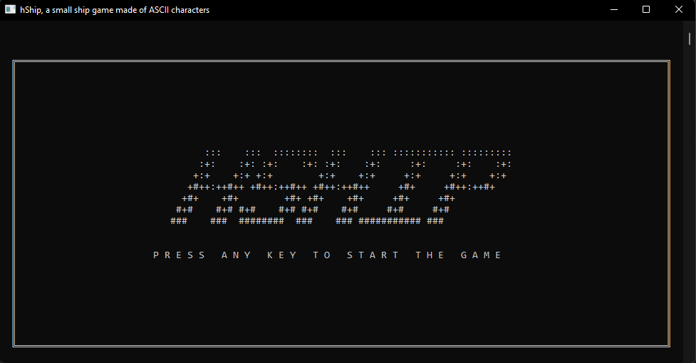

<h1 align="center">hShip <i>(a.k.a rShip)</i></h1>

A tiny ships game made of ASCII characters

**hShip** is a small ships game made from simple **ASCII** characters, for **Windows** devices.
It is worth mentioning that this repository contains the code of the **rShip** project, which is nothing more than an *improved* version and *rewritten from scratch* of the original project *(a.k.a a remake)*.
Of course, the *source code* of the original project and its *binaries* will be available in the [releases section](https://github.com/h3nry-d1az/rShip/releases) so that a comparison can be made between the two, but I must warn you that the original version is only in **Spanish**.
Also, this game is *(like most of my titles)* published on the [itch.io](https://itch.io/) platform, so you can find *this same information* as well as *download the game binaries* more easily on [that page](https://h3nry-d1az.itch.io/hShip).

This is, however, a small project that I carried out **quite some time ago**, so don't expect *high quality* as most of the code has remained the same *(except for the language change from being written in C /C++ to being in Rust)*.

### Install instructions
#### Get the already compiled binary
1. **Click on the** *hShip.Win64.zip* **file** and then **unzip it**.
2. Then **execute the file with extension .exe** contained in the newly extracted folder *(hShip.exe)*.
3. *(Optional)* **Move the newly extracted directory to a safe location** *(such as* `C:\`*)* and **add the folder to your** `PATH` **variable**.

#### Build the project from source code
1. **Click on the** *hShip.Source.zip* **file** and then **unzip it**, or **clone the repository via git** *(run* `git clone https://github.com/h3nry-d1az/rShip.git` *in* **CMD** *or* **PowerShell** *)*.
2. **Then compile it using cargo** *(if you don't have* **Rust** *installed go* [here](https://www.rust-lang.org/)*)* **using the command** `cargo build --release` if you want to build **just the binary** or **run** `cargo install --path .` to **install it**.

#### Easiest method *(requires* [Rust installed](https://www.rust-lang.org/) *)*
1. Just **run the command** `cargo install --git https://github.com/h3nry-d1az/rShip.git` and **wait for it to finish** *(* **Warning:** **hShip** *will be installed in this case under the name* **rShip** *)*.

### Gameplay
#### Instructions
**hShip** is an **infinite spaceship game** in which you will have to **destroy asteroids** to increase your score, **preventing them from hitting you**.
There are **three types of asteroids** that have **different properties**:
<table>
<thead>
  <tr>
    <td><b>Size</b></td>
    <td><b>Health</b></td>
    <td><b>Damage</b></td>
    <td><b>Score</b></td>
    <td><b>Shape</b></td>
  </tr>
</thead>
<tbody>
  <tr>
    <td><b>Small</b></td>
    <td><b>One</b> shot</td>
    <td><b>One</b> health point</td>
    <td><b>100</b> points</td>
    <td>▓</td>
  </tr>
  <tr>
    <td><b>Medium</b></td>
    <td><b>Three</b> shots</td>
    <td><b>Two</b> health point</td>
    <td><b>300</b> points</td>
    <td>▒▒ ▒▒</td>
  </tr>
  <tr>
    <td><b>Huge</b></td>
    <td><b>Five</b> shots</td>
    <td>Instant kill</td>
    <td><b>500</b> points</td>
    <td>░░░ ░░░</td>
  </tr>
</tbody>
</table>

Also, when you manage to collect **2000 points** you will get **an extra life**, and when you **reach 4000** a **new asteroid will appear**.

#### Normal controls
<table>
<thead>
  <tr>
    <td><b>Key</b></td>
    <td><b>Action</b></td>
  </tr>
</thead>
<tbody>
  <tr>
    <td><kbd>W</kbd> / <kbd>↑</kbd></td>
    <td>Move the ship <b>up</b></td>
  </tr>
  <tr>
    <td><kbd>A</kbd> / <kbd>←</kbd></td>
    <td>Move the ship <b>left</b></td>
  </tr>
  <tr>
    <td><kbd>S</kbd> / <kbd>↓</kbd></td>
    <td>Move the ship <b>down</b></td>
  </tr>
  <tr>
    <td><kbd>D</kbd> / <kbd>→</kbd></td>
    <td>Move the ship <b>right</b></td>
  </tr>
  <tr>
    <td><kbd>Z</kbd> / <kbd>⎵</kbd> / <kbd>.</kbd></td>
    <td>Fire</td>
  </tr>
  <tr>
    <td><kbd>P</kbd></td>
    <td><b>Pause</b> the <b>game</b></td>
  </tr>
</tbody>
</table>

#### Debugging controls
<table>
<thead>
  <tr>
    <td><b>Key</b></td>
    <td><b>Action</b></td>
  </tr>
</thead>
<tbody>
  <tr>
    <td><kbd>L</kbd></td>
    <td>Add <b>100 points</b> to score</td>
  </tr>
  <tr>
    <td><kbd>E</kbd></td>
    <td><b>Reduce character's health</b> by <b>33%</b></td>
  </tr>
</tbody>
</table>

#### Some screenshots

<em>Title screen</em>

 

<em>Start of the game</em>

 

<em>Pause screen</em>

 

<em>Regular game</em>

 

<em>Game over screen</em>

I hope you enjoy it and if so, please **leave a positive review, give the project a star and share it**, it would help me a lot.
